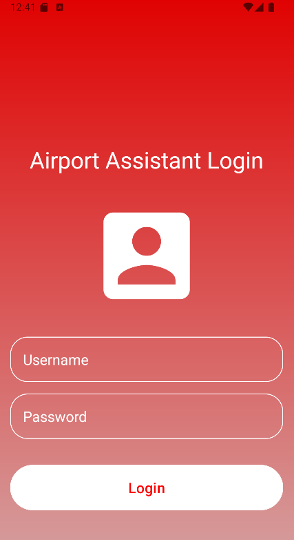
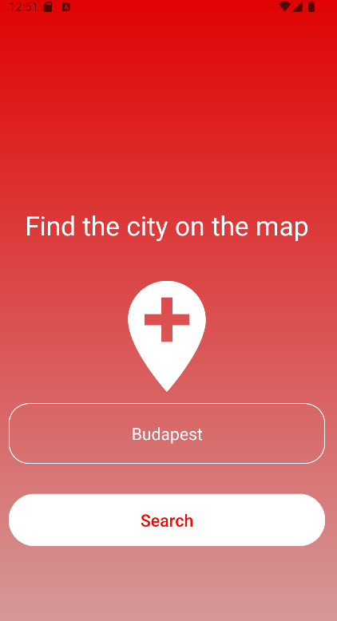
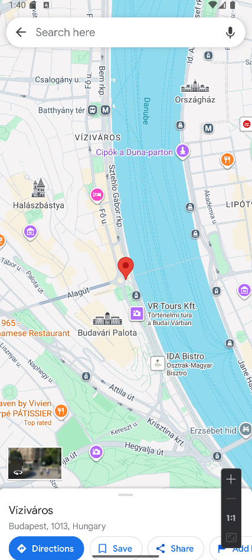
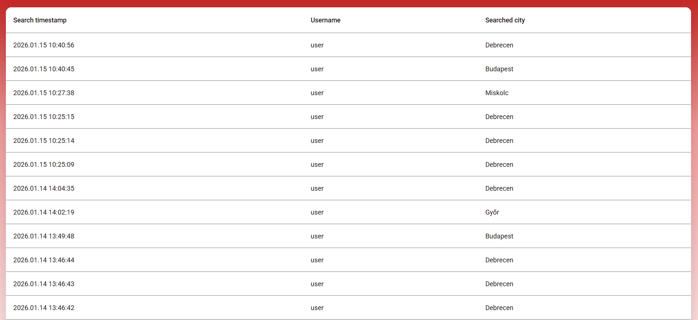

# **Airport Assistant System**

This project is a mobile application, supported by a backend service, that allows pilots to retrieve geographic coordinates of destination locations.  

## **Level reached**

### **Level 1**
- Login Screen ✔️
- Search Screen ✔️
### **Level 2**
- Backend Development ✔️
- Mobile Modification ✔️
### **Level 3**
- Web Admin Interface ✔️ 
- Asynchronous Messaging ✔️
- Docker ❌ (Dockerfiles and docker-compose present, but not correctly implemented)

---

## **System Architecture**

### **Application**
- Mobile frontend application for pilots
- Provides `user` authentication
- Allows `user`s to retrieve geographic coordinates based on city names
- Communicates with the backend via REST API

### **Backend**
- Java-based Spring Boot application
- Handles business logic and data processing
- Secured using OAuth 2.0 authentication with JWT-based authorization
- Exposes REST APIs consumed by the Android app and admin frontend
- Uses an `H2` persistent database stored at `/data/AirportAssistantDB.mv.db`
- After each coordinate request, `history` logs are persisted asynchronously using `RabbitMQ`
- Publishes search events to a message queue for non-blocking processing

### **Messaging**
- `RabbitMQ` is used for asynchronous communication
- Consumes search events sent by the backend
- Persists search `history` logs into the database

### **Database**
- `H2` persistent database
- Contains a `searcher` table storing `user` credentials
- Contains a `history` table that stores all previous search records

### **Frontend**
- Angular-based web application
- Used for administrative purposes
- Displays `history` records
- Communicates with the backend via REST API

---

## **Prerequisites**

- **Java: 17**
- **Spring Boot: 4.0.1**
- **Maven**
- **Node: 20.11.1**
- **Angular CLI: 19.2.19**
- **Angular: 19.2.18**
- **RabbitMQ: 4.2.2**
- **Erlang 27.3.4.6**
- **Android Studio**
- **Git**
- **Docker** & **Docker Compose**
---

## Startup Instructions

### 1. Clone the repository:
- ```bash
   git clone https://github.com/nacsacsa/Airport-Assistant-System
   cd Airport-Assistant-System
   ```
### 2. Start the backend:
- Navigate to the backend folder and run the Spring Boot application:
-  ```bash
   cd Airport-Assistant-backend
   mvn spring-boot:run
   ```
- The backend will start on http://localhost:8080
- RabbitMQ interface is available at http://localhost:15672
### 3. Start the frontend admin interface:
- Open a Node.js command prompt and navigate to the Angular project folder:
-  ```bash
    cd Airport-Assistant-System/Angular-Web-Admin
    ng serve
   ```
- The admin interface will be accessible at http://localhost:4200
### 4. Run the Android App:
- Open the Kotlin project in Android Studio.
- Run the application on an emulator.
- The user interface should look like this: 
- 
- Default `user`:
Username: **user**
Password: **pass**
- After logging in, you will see the search screen: 
- 
- Select a city and press **Search**.
- The **Google Maps** will open, showing the location on the map:
- 
- The search query will be logged and visible in the web admin interface:
- 
## Notes
- You can create a new `user` using `Postman` or any HTTP client.
- Endpoint:
POST http://localhost:8080/api/register
- Request Body (JSON):
```json
{
  "name": "your_username",
  "password": "your_password"
}
```